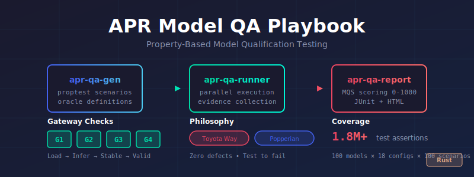

# APR Model QA Playbook

<p align="center">
  
</p>

<p align="center">
  <strong>Property-Based Model Qualification Testing for HuggingFace Models</strong>
</p>

<p align="center">
  <a href="#philosophy">Philosophy</a> •
  <a href="#features">Features</a> •
  <a href="#quick-start">Quick Start</a> •
  <a href="#architecture">Architecture</a> •
  <a href="#test-matrix">Test Matrix</a> •
  <a href="#mqs-scoring">MQS Scoring</a>
</p>

---

## Philosophy

This framework synthesizes two complementary quality paradigms:

### Toyota Production System (TPS)

> *"Stop the line. Fix it now. Never pass a defect to the next process."*
> — Taiichi Ohno

| Principle | Application |
|-----------|-------------|
| **Jidoka** | Execution halts on first P0 failure |
| **Poka-Yoke** | Schema validation prevents malformed playbooks |
| **Genchi Genbutsu** | All metrics from actual inference |
| **Heijunka** | Load-balanced parallel execution |
| **Kaizen** | Continuous refinement via mutation testing |

### Popperian Falsificationism

> *"The criterion of the scientific status of a theory is its falsifiability."*
> — Karl Popper

We don't test to pass—we **test to fail**. No amount of passing tests proves correctness, but a single failure proves a defect.

| Outcome | Meaning |
|---------|---------|
| `Corroborated` | Hypothesis survived refutation attempt |
| `Falsified` | Hypothesis refuted by evidence |
| `Timeout` | Execution exceeded time limit |
| `Crashed` | Process terminated abnormally |

## Features

- **Property-based testing** via proptest for comprehensive scenario generation
- **Parallel execution** with Rayon worker pools
- **Gateway checks (G1-G4)** that zero the score on critical failures
- **Model Qualification Score (MQS)** 0-1000 with grade mapping
- **JUnit XML and HTML reports** for CI/CD integration
- **Playbook YAML format** with JSON Schema validation
- **1.8M+ test assertions** across all model/format/backend combinations
- **217 falsification gates** across conversion, inference, patterns, and security domains

### New in v1.3.0

| Feature | Description |
|---------|-------------|
| **Rosetta Differential Testing** | Tensor layout mismatch, token comparison, fingerprint, stats validation |
| **Profile CI Mode** | Performance assertions for CI/CD (`--assert-throughput`, `--assert-p99`) |
| **Trace Payload Mode** | Real forward pass with NaN/Inf and garbage output detection |
| **Bug Pattern Detection** | 12 cross-project patterns from aprender/realizar analysis |
| **Bug Classification** | 6 conversion bug types (tokenizer missing, embedding transposition, etc.) |
| **GH-186 Detection** | PAD token flood and LayerNorm zero detection gates |

## Model Certifications

<!-- CERTIFICATION_TABLE_START -->
**Certification Summary** (updated: 2026-01-31 16:41 UTC)

| Status | Count |
|--------|-------|
| Certified | 0/12 |
| Provisional | 0/12 |
| Blocked | 4/12 |
| Pending | 8/12 |

**Priority Family:** Qwen Coder (see [Certified Testing Spec](docs/specifications/certified-testing.md))

| Model | Family | Size | Status | MQS | Grade | G1 | G2 | G3 | G4 |
|-------|--------|------|--------|-----|-------|----|----|----|----|
| [deepseek-coder-1.3b-instruct](https://huggingface.co/deepseek-ai/deepseek-coder-1.3b-instruct) | deepseek-coder | 1.3B |  | 0 | - | - | - | - | - |
| [gemma-2-2b-it](https://huggingface.co/google/gemma-2-2b-it) | gemma | 2B |  | 0 | - | - | - | - | - |
| [Llama-3.2-1B-Instruct](https://huggingface.co/meta-llama/Llama-3.2-1B-Instruct) | llama | 1B |  | 0 | - | - | - | - | - |
| [Llama-3.2-3B-Instruct](https://huggingface.co/meta-llama/Llama-3.2-3B-Instruct) | llama | 3B |  | 0 | - | - | - | - | - |
| [Mistral-7B-Instruct-v0.3](https://huggingface.co/mistralai/Mistral-7B-Instruct-v0.3) | mistral | 7B |  | 0 | - | - | - | - | - |
| [Phi-3-mini-4k-instruct](https://huggingface.co/microsoft/Phi-3-mini-4k-instruct) | phi | 3.8B |  | 0 | - | - | - | - | - |
| [Qwen2.5-Coder-0.5B-Instruct](https://huggingface.co/Qwen/Qwen2.5-Coder-0.5B-Instruct) | qwen-coder | 0.5B |  | 189 | F | ✓ | ✓ | ✓ | ✓ |
| [Qwen2.5-Coder-1.5B-Instruct](https://huggingface.co/Qwen/Qwen2.5-Coder-1.5B-Instruct) | qwen-coder | 1.5B |  | 189 | F | ✓ | ✓ | ✓ | ✓ |
| [Qwen2.5-Coder-3B-Instruct](https://huggingface.co/Qwen/Qwen2.5-Coder-3B-Instruct) | qwen-coder | 3B |  | 189 | F | ✓ | ✓ | ✓ | ✓ |
| [Qwen2.5-Coder-7B-Instruct](https://huggingface.co/Qwen/Qwen2.5-Coder-7B-Instruct) | qwen-coder | 7B |  | 189 | F | ✓ | ✓ | ✓ | ✓ |
| [Qwen2.5-Coder-14B-Instruct](https://huggingface.co/Qwen/Qwen2.5-Coder-14B-Instruct) | qwen-coder | 14B |  | 0 | - | - | - | - | - |
| [Qwen2.5-Coder-32B-Instruct](https://huggingface.co/Qwen/Qwen2.5-Coder-32B-Instruct) | qwen-coder | 32B |  | 0 | - | - | - | - | - |
<!-- CERTIFICATION_TABLE_END -->

## Quick Start

```bash
# Build all crates
make build

# Run all tests
make test

# Generate coverage report
make coverage

# Run a specific playbook
cargo run --bin apr-qa -- run playbooks/models/qwen2.5-coder-1.5b.playbook.yaml

# Run with parallel workers
cargo run --bin apr-qa -- run playbooks/models/*.yaml --workers 8
```

## Architecture

```
┌──────────────────────────────────────────────────────────────────┐
│                     APR-MODEL-QA-PLAYBOOK                        │
├──────────────────────────────────────────────────────────────────┤
│                                                                  │
│  ┌──────────────┐    ┌──────────────┐    ┌──────────────┐       │
│  │ apr-qa-gen   │    │ apr-qa-runner│    │apr-qa-report │       │
│  │              │───▶│              │───▶│              │       │
│  │ • proptest   │    │ • parallel   │    │ • MQS score  │       │
│  │ • scenarios  │    │ • execution  │    │ • JUnit XML  │       │
│  │ • oracles    │    │ • evidence   │    │ • HTML       │       │
│  └──────────────┘    └──────────────┘    └──────────────┘       │
│                                                                  │
└──────────────────────────────────────────────────────────────────┘
```

### Crate Structure

| Crate | Purpose |
|-------|---------|
| `apr-qa-gen` | Scenario generation with proptest, oracle definitions |
| `apr-qa-runner` | Playbook execution, differential testing, bug patterns |
| `apr-qa-report` | MQS scoring, JUnit/HTML report generation |
| `apr-qa-cli` | Command-line interface |

### Key Modules (apr-qa-runner)

| Module | Purpose |
|--------|---------|
| `conversion.rs` | Format conversion testing with bug classification |
| `differential.rs` | Rosetta diff-tensors, compare-inference, profile CI |
| `patterns.rs` | Cross-project bug pattern detection (12 patterns) |
| `process.rs` | Jidoka process lifecycle management |

## Test Matrix

The framework tests models across multiple dimensions:

| Dimension | Options |
|-----------|---------|
| **Modality** | `run`, `chat`, `serve` |
| **Backend** | `cpu`, `gpu` |
| **Format** | `gguf`, `safetensors`, `apr` |
| **Quantization** | `q4_k_m`, `q5_k_m`, `q8_0`, `f16`, `f32` |

With 100 scenarios per combination across 100 HuggingFace models:
- 3 modalities × 2 backends × 3 formats × 100 models × 100 scenarios = **1,800,000 tests**

## MQS Scoring

The **Model Qualification Score (MQS)** ranges from 0-1000:

### Gateway Checks (G1-G4)

Any gateway failure **zeros the entire score**:

| Gateway | Check | Failure Impact |
|---------|-------|----------------|
| **G1** | Model loads successfully | MQS = 0 |
| **G2** | Basic inference works | MQS = 0 |
| **G3** | No crashes or panics | MQS = 0 |
| **G4** | Output is not garbage | MQS = 0 |

### Grade Mapping

| Score | Grade | Status |
|-------|-------|--------|
| 950-1000 | A+ | Production Ready |
| 900-949 | A | Production Ready |
| 850-899 | B+ | Conditional |
| 800-849 | B | Conditional |
| 700-799 | C | Development Only |
| 0-699 | F | Blocked |

## Playbook Format

```yaml
version: "1.0"
model:
  id: "Qwen/Qwen2.5-Coder-1.5B"
  revision: "main"

test_matrix:
  modalities: [run, chat]
  backends: [cpu, gpu]
  formats: [gguf, safetensors]

scenarios:
  - name: "arithmetic_basic"
    prompt: "What is 2 + 2?"
    oracle: arithmetic
    expected: 4

  - name: "code_generation"
    prompt: "Write a Python function to reverse a string"
    oracle: code_syntax
    language: python

# Differential Testing (v1.3.0)
differential_tests:
  tensor_diff:
    enabled: true
    filter: "embed,lm_head"
    gates: ["F-ROSETTA-DIFF-001"]
  inference_compare:
    enabled: true
    prompt: "What is 2+2?"
    tolerance: 1e-5

# Profile CI Assertions (v1.3.0)
profile_ci:
  enabled: true
  assertions:
    min_throughput: 10.0  # tok/s
    max_p99_ms: 500       # ms

# Trace Payload (v1.3.0)
trace_payload:
  enabled: true
  gates: ["F-TRACE-PAYLOAD-001", "F-TRACE-PAYLOAD-002"]
```

## Project Structure

```
apr-model-qa-playbook/
├── crates/
│   ├── apr-qa-gen/        # Scenario generation + oracles
│   ├── apr-qa-runner/     # Playbook execution
│   ├── apr-qa-report/     # MQS scoring + reports
│   └── apr-qa-cli/        # CLI binary
├── playbooks/
│   ├── models/            # Per-model playbooks
│   ├── templates/         # Reusable templates
│   ├── verify/            # Ticket verification
│   └── spec/              # Executable specifications
├── book/                  # mdBook documentation
└── docs/
    └── specifications/    # Full specification
```

## Development

```bash
# Run tests with coverage
make coverage

# Verify PMAT compliance (>= 95%)
make coverage-check

# Lint with clippy
make lint

# Full check (fmt + lint + test)
make check
```

## License

MIT License - see [LICENSE](LICENSE) for details.

---

<p align="center">
  Built with Rust • Powered by proptest • Inspired by Toyota & Popper
</p>
